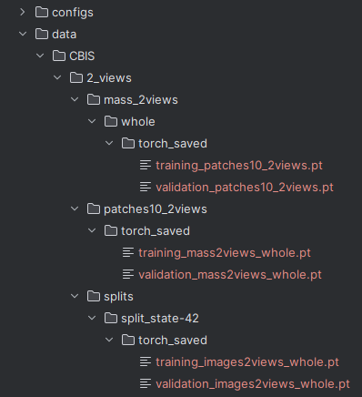

### This is a copy of the work "Multi-View Breast Cancer Classification via Hypercomplex Neural Networks"

### For the original owner and give the correct credits please go to: https://github.com/ispamm/PHBreast?tab=readme-ov-file

## This an academic use of the work for a graduate level Deep Learning class 2024.2.

To correctly setup the 'data' folder please follow the image:

Use the following links to download the images:

| Dataset          | Num views | Storage Mem | Link   |
|------------------|:---------:|:-----------:|:------:|
| CBIS - patches   | 2 views   | 1GB         | [Link](https://drive.google.com/file/d/15jVK-ICQ8c4zKp807q53ds5PEKsvNDzq/view?usp=sharing) |
| CBIS - mass      | 2 views   | 146MB       | [Link](https://drive.google.com/file/d/16H0JbQKecIy8i376--m_ut-PwXduRDNJ/view?usp=sharing) |
| CBIS - mass+calc | 2 views   | 290MB       | [Link](https://drive.google.com/file/d/1pPmFNwFbvDBvzD4Srw-p6Kw__r-gY7U8/view?usp=sharing) |
